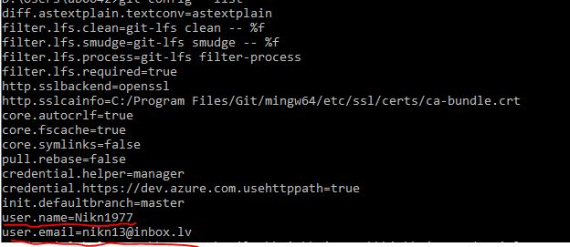

# DialogsAB_JS
Elektroniska klade par JavaScript
## JavaScript Kurss
**1. 16.10.2024 Sakums - ka stradat ar e-vide** :+1:

Ka strdada saitu atveršana

> [!NOTE]
>- Lokalo failu tst un html veidošana
>- Github.com eksperementešana ar Readme.md
>- ***E-Vide link : [https://e-vide.dialogs-ab.lv/]***
>- ***HTML Tutorial : https://www.w3schools.com/html/***
>- ***CSS Tutorial : https://www.w3schools.com/css/***
>- ***So, how does the Internet work? : https://www.linkedin.com/pulse/20141113001150-27608683-so-how-does-the-internet-work***
>- ***A small place to discover languages in GitHub : https://madnight.github.io/githut/#/pull_requests/2024/1***
>- ***What is JavaScript? : https://developer.mozilla.org/en-US/docs/Learn/JavaScript/First_steps/What_is_JavaScript***
>- ***How to work with Github : https://docs.github.com/en/get-started/writing-on-github/getting-started-with-writing-and-formatting-on-github/basic-writing-and-formatting-syntax***

| Downloads |
| --- |
| [***Visual Studio Code Downloads***]( https://code.visualstudio.com/) 
| [***GIT Downloads***](https://git-scm.com/downloads) |

**2. 21.10.2024 Programešana**
>- GIT software installation
>- Visual Studio Code Installation
>- Parbaudit vai Environment variablē zem "Path" eksiste ieraksts "C:\Progeam Files\Git\cmd"
>- Palaist Git.cmd un sakonfiguret talakai darbibai lai noklonet GitHUB Repository uz lokalu darbastaciju:
>- - Command - "git config --list"
>-  - Command - "git config --global user.name "Nikn1977"
>-  - Command - "git config --global user.nemail "nikn13@inbox.lv"
>-  - Command - "git config --list

>- Atvert Virtual Studio Code un Uzinstalet Extensions:
>- - Prettier-Code Formatter
>- - Github Repositories
>- - GitHub Pull Request
>- - Remote Repositories
>- - Live Server
>- Kad Extensions bus uzinstaleti, vajag uztaisit Sign In
>- Nospiest "F1" un atrast commandu "git clone"
>- Palaist commandu, izvelieties Github Repositories un noradit kur lokali tas vajag saglabat
>- Pameginat uztaisit izmaiņas no VSC un no Github lai parliecinaties ka sinhronizacija notiek uz abam pusem.
>- **Links:**
>- - ***Object Models in JavaScript : https://www.javascripttutorial.net/javascript-dom/document-object-model-in-javascript***
>  - ***HTML Tutorial : https://www.w3schools.com/html/default.asp***
>  - ***CSS Tutorial : https://www.w3schools.com/css/default.asp***
>  - ***HTML Exercises : https://www.w3schools.com/html/html_exercises.asp***
>  - ***JavaScript Where To : https://www.w3schools.com/js/js_whereto.asp***

**3. 23.10.2024 Programešana**
>- Styles(CSS)
>- - uz objektu(Inline CSS)
>- - uz objektiem locali(Internal CSS)
>- - uz objectiem no areja faila(External CSS)

