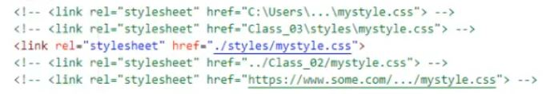
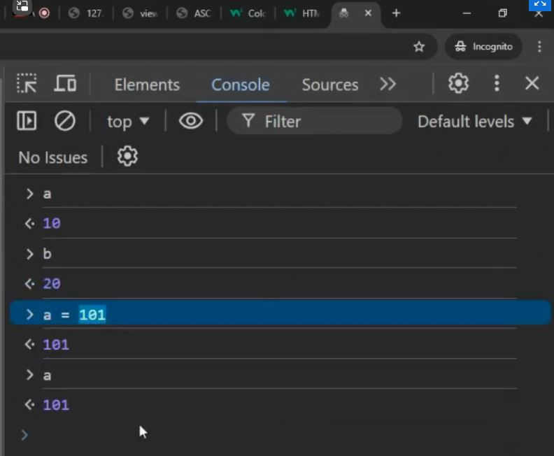
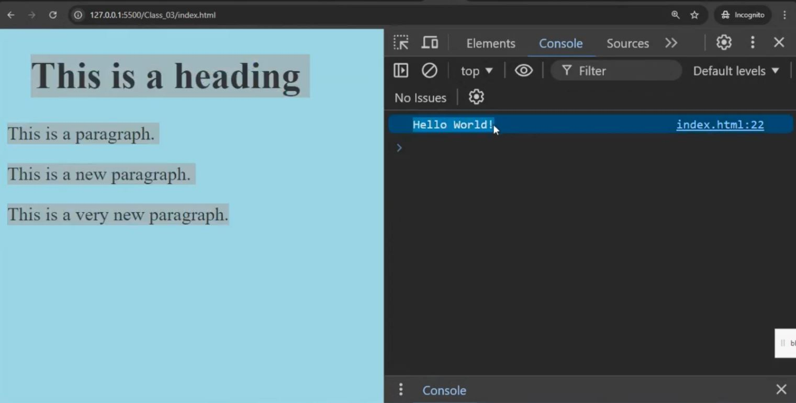

# DialogsAB_JS
Elektroniska klade par JavaScript
## JavaScript Kurss

**1. 16.10.2024 Sakums - ka stradat ar e-vide** :+1:

Ka strdada saitu atveršana

> [!NOTE]
>- Lokalo failu tst un html veidošana
>- Github.com eksperementešana ar Readme.md
>- ***E-Vide link : [https://e-vide.dialogs-ab.lv/]***
>- ***HTML Tutorial : https://www.w3schools.com/html/***
>- ***CSS Tutorial : https://www.w3schools.com/css/***
>- ***So, how does the Internet work? : https://www.linkedin.com/pulse/20141113001150-27608683-so-how-does-the-internet-work***
>- ***A small place to discover languages in GitHub : https://madnight.github.io/githut/#/pull_requests/2024/1***
>- ***What is JavaScript? : https://developer.mozilla.org/en-US/docs/Learn/JavaScript/First_steps/What_is_JavaScript***
>- ***How to work with Github : https://docs.github.com/en/get-started/writing-on-github/getting-started-with-writing-and-formatting-on-github/basic-writing-and-formatting-syntax***

| Downloads |
| --- |
| [***Visual Studio Code Downloads***]( https://code.visualstudio.com/) 
| [***GIT Downloads***](https://git-scm.com/downloads) |

 
 

**2. 21.10.2024 Programešana**
>- GIT software installation
>- Visual Studio Code Installation
>- Parbaudit vai Environment variablē zem "Path" eksiste ieraksts "C:\Progeam Files\Git\cmd"
>- Palaist Git.cmd un sakonfiguret talakai darbibai lai noklonet GitHUB Repository uz lokalu darbastaciju:
>- - Command - "git config --list"
>-  - Command - "git config --global user.name "Nikn1977"
>-  - Command - "git config --global user.nemail "nikn13@inbox.lv"
>-  - Command - "git config --list

>- Atvert Virtual Studio Code un Uzinstalet Extensions:
>- - Prettier-Code Formatter
>- - Github Repositories
>- - GitHub Pull Request
>- - Remote Repositories
>- - Live Server
>- Kad Extensions bus uzinstaleti, vajag uztaisit Sign In
>- Nospiest "F1" un atrast commandu "git clone"
>- Palaist commandu, izvelieties Github Repositories un noradit kur lokali tas vajag saglabat
>- Pameginat uztaisit izmaiņas no VSC un no Github lai parliecinaties ka sinhronizacija notiek uz abam pusem.
>- **Links:**
>- - ***Object Models in JavaScript : https://www.javascripttutorial.net/javascript-dom/document-object-model-in-javascript***
>-  - ***HTML Tutorial : https://www.w3schools.com/html/default.asp***
>-  - ***CSS Tutorial : https://www.w3schools.com/css/default.asp***
>-  - ***HTML Exercises : https://www.w3schools.com/html/html_exercises.asp***
>-  - ***JavaScript Where To : https://www.w3schools.com/js/js_whereto.asp***

 
 

**3. 23.10.2024 Programešana**
>- Styles(CSS)
>- - uz objektu(Inline CSS)
>- - uz objektiem locali(Internal CSS)
>- - uz objectiem no areja faila(External CSS)
>

>- Izveidojam "index.html" failu, ierakstijam konfiguraciju lai notestet dažadas stilus no style.css
>- Visual Studio Code - Start LiveServer opciju, lai index.html fails butu palaist no iebuveta "web servera" kas iespejams ar LiveServer opciju
>- ASCII code tabel

>- - ***Krasas : https://www.w3schools.com/colors***
>- - ***Krasas2 : : https://www.w3schools.com/colors/colors_picker.asp***
>- Pirmie soļi programešanā no browser Console
>- CTRL+Shift+J
>
    
>- JavaScript:
>- - console.log
>  - typeof()
>- Pirmie soļi programešanā no index.html faila
>- - 
>

>- ***Majas darbs - parbaudit JSREF operatorus : https://www.w3schools.com/jsref/jsref_operators.asp***
>- ***JavaScript Gramata : https://goalkicker.com/JavaScriptBook/***
 

 
 

**4. 26.10.2024 Programešana**
>- JavaScript:
>- - date = Date.now()
>- - date = new Date()
>- - console.log()
>- - "text1" + some_variable + "text2"
>- - `text1 ${some_variable} text2`
 
 

**5. 30.10.2024 Programešana-Arrays**

**6. 30.10.2024 Programešana-Arrays**

**7. 06.11.2024 “Pusdienlaika” uzdevumi**
>-  *** “Pusdienlaika” uzdevumi : [[https://htmlpreview.github.io/?https://github.com/Nikn1977/DialogsAB_JS/blob/main/MD2-Uzdevums2-If-While/index.html](https://htmlpreview.github.io/?https://github.com/Nikn1977/DialogsAB_JS/blob/main/MD2-Uzdevums2-If-While/index.html)]***

>-  *** “Pusdienlaika” uzdevumi ar Funkcijas palidzibu: [[https://htmlpreview.github.io/?https://github.com/Nikn1977/DialogsAB_JS/blob/main/MD2-Uzdevums2-If-While-Functions/index.html](https://htmlpreview.github.io/?https://github.com/Nikn1977/DialogsAB_JS/blob/main/MD2-Uzdevums2-If-While-Functions/index.html)]***

**7. 06.11.2024 Programešana-Funkcijas**

https://htmlpreview.github.io/?https://github.com/Nikn1977/DialogsAB_JS/blob/main/MD2-Uzdevums2-If-While/index.html

